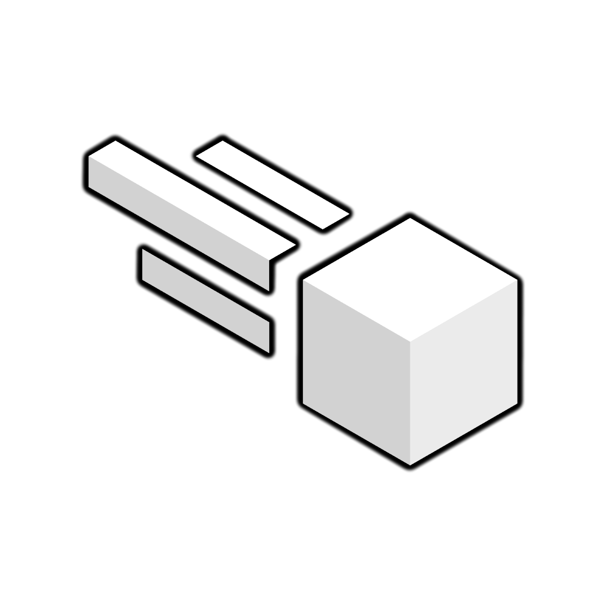

<h1 align="center">Meteorite</h1>

A Meteor fork for anarchy servers, with faster updates and experimental features.

> **Unofficial fork.** Meteorite is based on [Meteor Client](https://github.com/MeteorDevelopment/meteor-client) but is not affiliated with or supported by MeteorDevelopment. Expect it to be less stable than upstream Meteor.

## About

Meteorite is a Fabric utility mod for Minecraft anarchy servers, forked from Meteor Client.

Goals of this fork:
- Update to new Minecraft versions faster than upstream
- Ship experimental features I want to use
- Bundle Baritone out of the box, no separate install

Upstream Meteor remains the stable, supported choice. Use Meteorite if you want cutting-edge / experimental builds and accept the breakage risk.

## Differences from Meteor

- Faster / out-of-band Minecraft version bumps
- Experimental features that may never go upstream
- [Baritone](https://github.com/cabaletta/baritone) embedded directly (`src/main/java/baritone`), no separate `baritone` / `baritone-meteor` jar needed
- Rebranded as `meteorite-client` (`assets/meteorite-client`, `meteorite-client.mixins.json`, etc.)

## Stability warning

This fork prioritizes speed and experimentation over stability. Things may break, configs may reset between versions, and some modules may be unfinished. Don't use it on servers/worlds you care about without backups.

## Usage

### Requirements

- Minecraft Java Edition (see `gradle/libs.versions.toml` for current target version)
- Fabric Loader (see `fabric-loader` version in `gradle/libs.versions.toml`)
- Java matching `jdk` in `gradle/libs.versions.toml` to build, and the Java version Minecraft needs to run

### Building

- Clone this repository: `git clone https://github.com/FelipeFMAvelar/meteorite-client.git`
- Run `./gradlew build`
- Jar output will be in `build/libs/`

### Installation

1. Install [Fabric Loader](https://fabricmc.net/) for your Minecraft version
2. Drop the built `meteorite-client-*.jar` into your `mods` folder
3. Launch the game. Press Right Shift by default to open the GUI.

Upstream install docs also mostly apply: https://meteorclient.com/faq/installation

### Baritone

Baritone (LGPL-3.0, via Meteor's fork) is embedded directly in this mod under `src/main/java/baritone`.

- Do **not** install standalone `baritone` / `baritone-meteor` alongside it, they are marked as incompatible in `fabric.mod.json` and will conflict.
- Baritone chat prefix/commands follow Meteor's integration, see in-game Baritone settings.

## Bugs and Suggestions

Report bugs in this repo's [issue tracker](https://github.com/FelipeFMAvelar/meteorite-client/issues). Include:

- Meteorite version / commit, Minecraft version, Fabric Loader version
- Steps to reproduce, expected vs actual behavior
- `latest.log` and crash report if applicable
- Whether the bug also happens on upstream Meteor

Upstream Meteor bugs should go to MeteorDevelopment, not here.

## Contributions

Pull requests welcome, as long as:

- The license header is applied to all Java source files
- IDE / system files stay in `.gitignore`, never in PRs
- Code roughly matches existing style, favour readability over compactness
- Reference: [Google Java Style Guide](https://google.github.io/styleguide/javaguide.html)

## Credits

- [MeteorDevelopment](https://github.com/MeteorDevelopment/meteor-client) for Meteor Client
- [Cabaletta](https://github.com/cabaletta) and [WagYourTail](https://github.com/wagyourtail) for [Baritone](https://github.com/cabaletta/baritone)
- The [Fabric Team](https://github.com/FabricMC) for [Fabric](https://github.com/FabricMC/fabric-loader) and [Yarn](https://github.com/FabricMC/yarn)

## Licensing

Licensed under [GNU General Public License v3.0](https://www.gnu.org/licenses/gpl-3.0.en.html). See [LICENSE](LICENSE).

If you use **ANY** code from this source (or upstream Meteor):

- You must disclose the source code of your modified work and the source code you took from this project. No closed-source / obfuscated use, even partially.
- You must state clearly to all end users that you are using code from this project.
- Your application must also be licensed under GPL-3.0.
